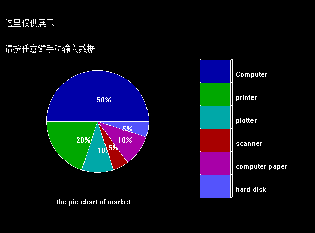
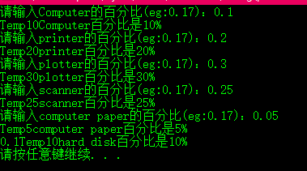
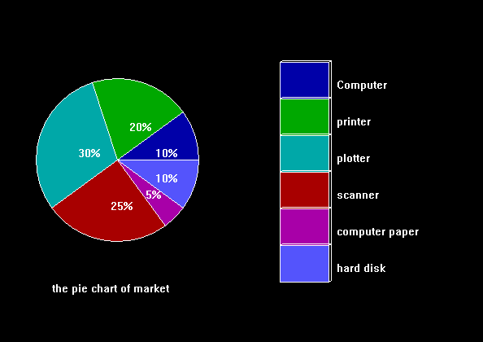
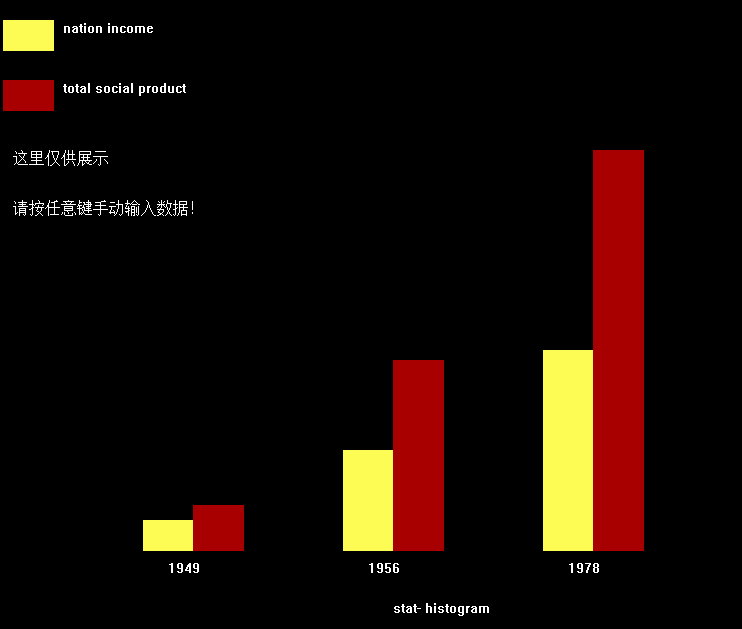
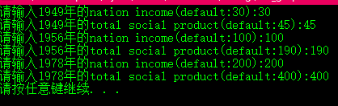
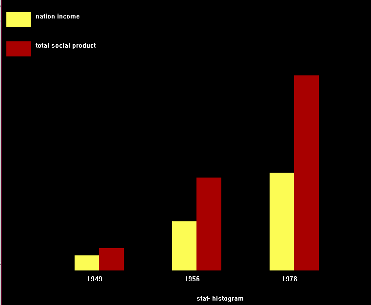

### 第一次计算机图形学实验

---------------------------

#### 1.实验目的
- （1）熟悉C语言的图形图像函数

---------------------------

#### 2.实验内容
- （1）   根据某公司上半年产品销售状况是：computer50%、printer20%、plotter10%，scanner5%、computer paper10%、hard disk5%。试画出下图所示的饼状图
###### 说明：填充颜色和方式可以自定义
- （2）绘制柱状图

##### _注意_：
- （1）各年国民收入的值和社会总产值自己给出。
- （2）程序必须数值是可以通过键盘输入，当数值改变时柱状图能够按比例自动发生变化。

---------------------------

#### 3.实验结果
（1）根据某公司上半年产品销售状况是：computer50%、printer20%、plotter10%，scanner5%、computer paper10%、hard disk5%。试画饼状图。
实验截图：  

------------------------
###### 首先展示原图



-------------------------

######  用户手动输入：  



-------------------------

######  用户手动输入的百分比饼图：  



------------------------

实验说明： 本实验的难点在于这个百分比的字符串如何在饼图
上显示，主要思路是根据饼的块的两头角度定位置,设圆心坐标
（x,y）,其中一块饼的起始角度和最终角度的平均值设为angleA,
就是那块饼中心射线的角度则百分比字符的起始坐标（x+k*radis*
cos(angleA),y+k*radis*sin(angleA),(这里radis是半径，
k值控制离圆心距离，可自行调节)。

-------------------------

实验源码：


```cpp
#include <graphics.h>
#include <conio.h>
#include <iostream>
#include <string>
#include <cmath>
#include <windows.h>
#include <sstream>
using namespace std;
const int BAR_START_X=400;
const int BAR_START_Y=180;
const int BAR_WIDTH= 60;
const int BAR_HEIGHT=45;
const int TITLE_X=120;
const int TITLE_Y=450;
const char TITLE_TEXT[40]={"the pie chart of market"};
float stangle =0;
double dcita = 360.0/100.0;
float top = 400.0;
float left = 200.0;
float w = 40.0;
float h = 100.0;
int mycolor[6]={BLUE,GREEN,CYAN,RED,MAGENTA,LIGHTBLUE};
double percent[6]={0.50,0.20,0.10,0.05,0.10,0.05};
char Text[6][20]={"50%","20%","10%","5%","10%","5%"};
char Name[6][20]={"Computer","printer","plotter","scanner","computer paper","hard disk"};
void show(){
	float x=200,y=300,radis=100.0;
	float endangle;
	int textx;
	int texty;
	int barleft=BAR_START_X;
	int bartop=BAR_START_Y;
	initgraph(1000, 1000);
	for(int i=0;i<6;i++){
		endangle = stangle +dcita*100*percent[i];
		setfillstyle(mycolor[i]);
		pieslice(x,y,stangle,endangle,radis);
		textx=x+radis*0.5*cos(0.5*(stangle+endangle)*0.0174533);
		//1 degree = 0.0174533 rad
		texty=y-radis*0.5*sin(0.5*(stangle+endangle)*0.0174533);
		outtextxy(textx,texty,Text[i]);
		bar3d(barleft,bartop,barleft+BAR_WIDTH,bartop+BAR_HEIGHT,3,true);
		outtextxy(barleft+BAR_WIDTH+10,bartop+20,Name[i]);
		bartop+=BAR_HEIGHT;
		outtextxy(TITLE_X,TITLE_Y,TITLE_TEXT);
		stangle = endangle;
		top=top+h;
	}
	outtextxy(20,100,"这里仅供展示");
	outtextxy(20,150,"请按任意键手动输入数据！");
	getch();
	closegraph();
}
template<class T>
void to_string(string & result,const T& t){
    //to_string 用了类模板，将数值类型如int之类转化成string类型
    //to_string函数要用到sstream.h这个头文件（原stringstream.h较老，已弃用）
    //原理是创建一个流，把值传递如流中，获取转换后的字符转并将其写入目的字符串
        ostringstream oss;//创建一个流
        oss<<t;//把值传递如流中
        result=oss.str();//获取转换后的字符转并将其写入result
}
char InputText[6][10]={NULL};
void getPercent(){
InputAgain:
	double totalpercent=0.0;
	for(int i=0;i<6;i++){
		if(i!=5){
			cout<<"请输入"<<Name[i]<<"的百分比(eg:0.17)：";
			cin>>percent[i];
			totalpercent+=percent[i];
		}
		else{
			if(totalpercent>1){
				cout<<"对不起，你输入的百分比之和已经超过100%,请重新输入！";
				goto InputAgain;
			}
			double all=1.0;
			percent[5]=all-totalpercent;
			cout<<percent[5];
		}

		int Temp=(int)ceil(percent[i]*100);
		cout<<"Temp"<<Temp;
		itoa(Temp,InputText[i],10);
		char *b="%";
		strcat(InputText[i],b);
		cout<<Name[i]<<"百分比是"<<InputText[i]<<endl;
	}
	system("pause");
}
void InputData(){
	getPercent();
	float x=200,y=300,radis=100.0;
	float endangle;
	int textx;
	int texty;
	int barleft=BAR_START_X;
	int bartop=BAR_START_Y;
	initgraph(1000, 1000);
	for(int i=0;i<6;i++){
		endangle = stangle +dcita*100*percent[i];
		setfillstyle(mycolor[i]);
		pieslice(x,y,stangle,endangle,radis);
		textx=x+radis*0.5*cos(0.5*(stangle+endangle)*0.0174533);
		//1 degree = 0.0174533 rad
		texty=y-radis*0.5*sin(0.5*(stangle+endangle)*0.0174533);
		outtextxy(textx,texty,InputText[i]);
		bar3d(barleft,bartop,barleft+BAR_WIDTH,bartop+BAR_HEIGHT,3,true);
		outtextxy(barleft+BAR_WIDTH+10,bartop+20,Name[i]);
		bartop+=BAR_HEIGHT;
		outtextxy(TITLE_X,TITLE_Y,TITLE_TEXT);
		stangle = endangle;
		top=top+h;
	}
	getch();
	closegraph();

}
int main(){
	show();
	InputData();
	return 0;
}

```

---------------------------

实验截图：
###### 首先展示原图



-------------------------

######  用户手动输入：  



-------------------------

######  用户手动输入的百分比饼图：  



------------------------

实验说明：此实验比较简单，但容易写得很乱。
函数命名和常量命名时应当明白易懂。
应当对调用的函数进行一层一层的包装，让它更
好用。  
函数说明：
My_yellow_bar实现画黄色图例功能，
My_red_bar实现画红色图例功能，
My_legend_bar对上面两个函数进行包装，
实现画图例功能，
Year_red_yellow_Bar画某一年的nation income
和total social product的柱状图。
全局变量Year_left_X为每一年的柱状图的最左侧x的值
，随着年的变化而变化。

------------------------


实验源码：

```cpp
#include <graphics.h>
#include <conio.h>
#include <iostream>
#include <string>
#include <cmath>
#include <windows.h>
using namespace std;
const int LEGEND_LB_X=10;
const int LEGEND_LB_Y=100;
const int LEGEND_HEIGHT=30;
const int INIT_BAR_LEFT=150;
const int BAR_WIDTH=50;
const int BAR_BOTTOM=600;
const char YELLOW_TEXT[14]={"nation income"};
const char RED_TEXT[21]={"total social product"};
const char YEAR_TEXT[3][10]={"1949","1956","1978"};
void My_yellow_bar(int left_bottom_x,int left_bottom_y,int bar_height){
	setfillstyle(YELLOW);
	bar(left_bottom_x,left_bottom_y-bar_height,left_bottom_x+BAR_WIDTH,left_bottom_y);
}
void My_red_bar(int left_bottom_x,int left_bottom_y,int bar_height){
	setfillstyle(RED);
	bar(left_bottom_x,left_bottom_y-bar_height,left_bottom_x+BAR_WIDTH,left_bottom_y);
}
void My_legend_bar(){
	My_yellow_bar(LEGEND_LB_X,LEGEND_LB_Y,LEGEND_HEIGHT);
	My_red_bar(LEGEND_LB_X,LEGEND_LB_Y+LEGEND_HEIGHT+30,LEGEND_HEIGHT);
	outtextxy(LEGEND_LB_X+BAR_WIDTH+10,LEGEND_LB_Y-LEGEND_HEIGHT,YELLOW_TEXT);
	outtextxy(LEGEND_LB_X+BAR_WIDTH+10,LEGEND_LB_Y+LEGEND_HEIGHT+30-LEGEND_HEIGHT,RED_TEXT);
}
int Year_left_X=INIT_BAR_LEFT;
int Year_Time=0;
const int Year_bar_distance=2*BAR_WIDTH+100;
void Year_red_yellow_Bar(int yellow_bar_height,int red_bar_height){
	My_yellow_bar(Year_left_X,BAR_BOTTOM,yellow_bar_height);
	My_red_bar(Year_left_X+BAR_WIDTH,BAR_BOTTOM,red_bar_height);
	outtextxy(Year_left_X+BAR_WIDTH/2,BAR_BOTTOM+10,YEAR_TEXT[Year_Time]);Year_Time++;
	Year_left_X+=Year_bar_distance;

}
void show(){
	initgraph(1000, 1000);
	My_legend_bar();
	Year_red_yellow_Bar(30,45);
	Year_red_yellow_Bar(100,190);
	Year_red_yellow_Bar(200,400);
	outtextxy(400,650,"stat- histogram");
	outtextxy(20,200,"这里仅供展示");
	outtextxy(20,250,"请按任意键手动输入数据！");
	getch();
	closegraph();
};
bool InputDataInit=false;
void InputData(){
	if(!InputDataInit){
		Year_left_X=INIT_BAR_LEFT;
		Year_Time=0;
		//重新初始化
		InputDataInit=true;
	}
	int nation_1949,social_1949,nation_1956,social_1956,
			nation_1978,social_1978;
	cout<<"请输入1949年的nation income(default:30):";
	cin>>nation_1949;
	cout<<"请输入1949年的total social product(default:45):";
	cin>>social_1949;
	cout<<"请输入1956年的nation income(default:100):";
	cin>>nation_1956;
	cout<<"请输入1956年的total social product(default:190):";
	cin>>social_1956;
	cout<<"请输入1978年的nation income(default:200):";
	cin>>nation_1978;
	cout<<"请输入1978年的total social product(default:400):";
	cin>>social_1978;
	system("pause");
	initgraph(1000, 1000);
	My_legend_bar();
	Year_red_yellow_Bar(nation_1949,social_1949);
	Year_red_yellow_Bar(nation_1956,social_1956);
	Year_red_yellow_Bar(nation_1978,social_1978);
	outtextxy(400,650,"stat- histogram");
	//outtextxy(20,200,"这里仅供展示");
	//outtextxy(20,250,"请按任意键手动输入数据！");
	getch();
	closegraph();

}
int main(){
	show();
	InputData();
	return 0;
}

```
---------------------------

####  4.实验体会

- 1.要养成良好的编程习惯，比如命名规则，此次实验代码不多，
但有很多自定义的关于位置x,y值的常数，如果没有规范的命名规则，
那些常数看起来会很混乱。
- 2.要学会一层一层抽象，我开始编程时都写在一个main函数里，
虽然也实现了所有功能，但看起来不清晰，也不利于代码重用。
我对代码进行了优化，在做第二题时，注意把一些常用功能包装成
一个一个函数，方便我自己重用代码，也很快完成了任务。
- 3.计算机图形学虽然是一门计算机的课，但数学用到得很多，
它的意义主要倒不是帮我们复习C语言，而是来让我们熟悉各种算法
。这次实验虽然还没有用到很高深的数学，但算坐标之类时还是
让我们感受到数学的重要性。
