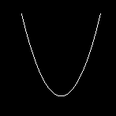
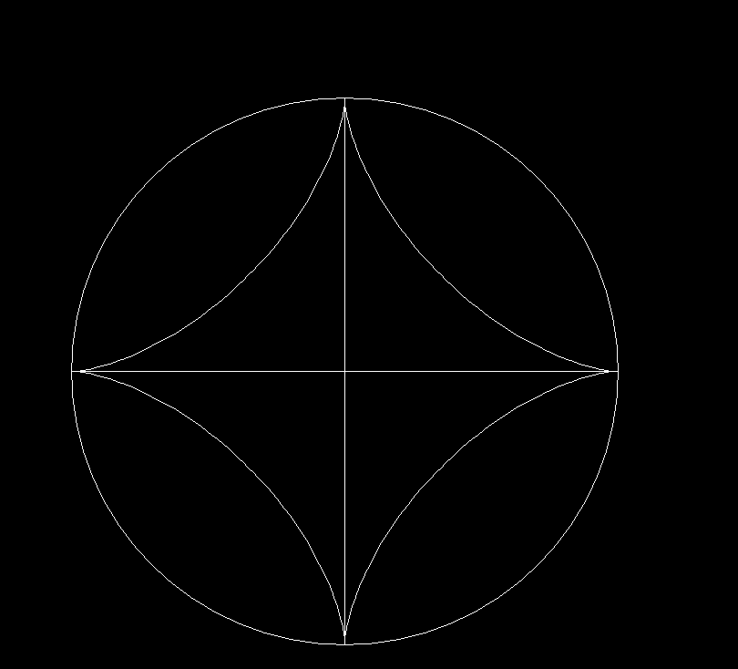

### 第二次计算机图形学实验

---------------------------

#### 实验题目1：抛物线的绘制。

---------------------------

#### 1.实验目的
- （1）熟悉C语言图形函数，实现任意数学函数曲线的绘制

---------------------------

#### 2.实验内容
- （1）标准方程：Y=X2/4p   （p值自己定）      
曲线以F(0,p)为焦点,曲线以Y轴为对称轴，其X的取值范围是任意的。

- （2）绘制抛物线

---------------------------

#### 3.实验结果

实验截图：

------------------------
###### 抛物线



------------------------

实验说明： 利用moveto 和 lineto 函数画出抛物线


-------------------------

实验源码：


```cpp
#include <graphics.h>
#include <conio.h>
#include <cmath>
#include <iostream>
#include <string>
#include <windows.h>
using namespace std;
 int Xc = 300;
 int Yc = 300;
const int L = 300;
const int H = 400;
const int p = 6;
const int n = 100;
int para_curve(){
	initgraph(1000, 1000);
	int X= (int)sqrt(2*p*H);
	if(X>L/2)X=L/2;
	int dx = 2*X/n;
	int m = n/2;
	int x=0;
	int y=0;
	for(int i=-m;i<=m;i++){
	x = i*dx;
	y=x*x/(4*p);
		if(i==-m){
			moveto(Xc+x,Yc-y);
		}else{
			lineto(Xc+x,Yc-y);
		}
	}
	system("pause");
	closegraph();
	return 0;
}
int main(){
	para_curve();
	return 0;
}
```

---------------------------

实验截图：
###### 效果图




------------------------

实验说明：本实验主要围绕参数方程展开，x和y的坐标随着t的变化而变。
在实际操作的时候
我的t用角度制，t从0度变化到360度便可画出
整个星形图，在计算x y坐标时我再把t换算成弧度
。
计算出x和 y 的值后，还需要从数学上的坐标换算成实际画图的坐标。
当然还是数学上的坐标
用起来比较舒服，我就按数学上的坐标进行画图，
则它的圆心在（0，0）点，因此，用两个简单的
平移函数对坐标进行变换。


X=a*cos3t  


Y=a*sin3t

------------------------


实验源码：

```cpp
#include <graphics.h>
#include <conio.h>
#include <cmath>
#include <iostream>
#include <string>
#include <windows.h>
using namespace std;
const int n = 100;
const int a = 300;
int translationx(int x){
x+=500;//圆心坐标x
return x;
}
int translationy(int y){
y+=500;
return y;//圆心坐标y
}
int main(){
	initgraph(1000, 1000);
	int x=0;
	int y=0;
	int t=0;
	double trad=0.0;
	for(int i=0;i<360;i++){
		moveto(translationx(x),translationy(y));
		trad=t*0.0174533;
		x=a*cos(trad)*cos(trad)*cos(trad);
		y=a*sin(trad)*sin(trad)*sin(trad);
		t++;
		lineto(translationx(x),translationy(y));
	}
	circle(translationx(0),translationy(0),a);
	line(translationx(0),translationy(0),translationx(0-a),translationy(0));
	line(translationx(0),translationy(-a),translationx(0),translationy(a));
	system("pause");
	closegraph();
return 0;

}

```
---------------------------

####  4.实验体会

- 1.通过本实验，初步了解了曲线应该如何绘制。
- 2.计算机图形学虽然是一门计算机的课，但数学用到得很多，
它的意义主要倒不是帮我们复习C语言，而是来让我们熟悉各种算法
。这次实验虽然还没有用到很高深的数学，但算坐标之类时还是
让我们感受到数学的重要性。
